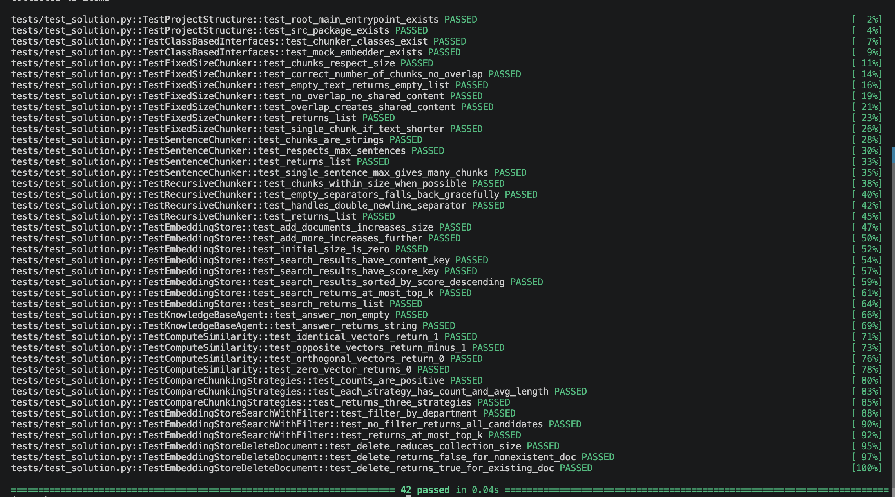

# Báo Cáo Cá Nhân — Lab 7: Embedding & Vector Store

**Họ tên:** Nguyễn Anh Dũng
**Nhóm:** Học bổng HUST
**Ngày:** 2026-09-19

> **Nộp 1 bản / sinh viên.** Phần nhóm (lựa chọn tài liệu, thiết kế chiến lược, bộ câu hỏi đánh giá, demo) nộp chung 1 bản trong `REPORT_NHOM.md`. Chi tiết thang điểm: `docs/SCORING.md`.

**Tổng điểm phần cá nhân: 60** = Khởi động (5) + Hướng tiếp cận (10) + Hoàn thiện code (30) + Dự đoán độ tương tự (5) + Kết quả truy xuất của tôi (10).

---

## 1. Khởi động (Warm-up) — Cá nhân (5 điểm)

### Độ tương tự Cosine (Cosine Similarity) (Bài tập 1.1)

**Độ tương tự cosine cao (High cosine similarity) nghĩa là gì?**
> Hai embedding có hướng gần nhau trong không gian vector, tức hai văn bản có nội dung hoặc ý nghĩa tương tự. Điểm càng gần 1 thì mức tương đồng ngữ nghĩa càng cao.

**Ví dụ có độ tương tự CAO:**
- Câu A: Sinh viên cần nộp hồ sơ học bổng trước ngày 9 tháng 10.
- Câu B: Hạn cuối gửi giấy tờ để xét học bổng là ngày 9/10.
- Tại sao tương đồng: Hai câu dùng từ khác nhau nhưng cùng truyền đạt một hạn nộp hồ sơ học bổng.

**Ví dụ có độ tương tự THẤP:**
- Câu A: Thư viện mở cửa đến 20 giờ vào ngày thường.
- Câu B: Sinh viên được xét học bổng dựa trên điểm học tập và rèn luyện.
- Tại sao khác: Hai câu đề cập các dịch vụ và thông tin không liên quan về ý nghĩa.

**Tại sao độ tương tự cosine (cosine similarity) được ưu tiên hơn khoảng cách Euclid (Euclidean distance) cho text embeddings?**
> Cosine so sánh hướng của các vector nên phù hợp khi độ dài văn bản khác nhau nhưng ý nghĩa vẫn gần nhau. Khoảng cách Euclid chịu ảnh hưởng trực tiếp hơn bởi độ lớn vector, vì vậy kém ổn định hơn cho việc so sánh embedding văn bản.

### Bài toán tính toán Chunking (Bài tập 1.2)

**Tài liệu 10,000 ký tự, chunk_size=500, overlap=50. Bao nhiêu chunks?**
> *Trình bày phép tính:* `ceil((10000 - 50) / (500 - 50)) = ceil(9950 / 450) = ceil(22.11...)`.
> *Đáp án:* 23 chunks.

**Nếu độ chồng chéo (overlap) tăng lên 100, số lượng chunk thay đổi thế nào? Tại sao muốn độ chồng chéo nhiều hơn?**
> Số chunk tăng thành `ceil((10000 - 100) / (500 - 100)) = ceil(9900 / 400) = 25` chunks. Overlap lớn hơn giúp nội dung ở ranh giới xuất hiện trong cả hai chunk, giảm nguy cơ mất ngữ cảnh khi truy xuất, nhưng tốn thêm bộ nhớ và số lần embedding.

---

## 2. Hướng tiếp cận của tôi (My Approach) — Cá nhân (10 điểm)

Giải thích cách tiếp cận của bạn khi lập trình (implement) các phần chính trong gói `src`.

### Các hàm chia nhỏ (Chunking Functions)

**`SentenceChunker.chunk`** — hướng tiếp cận:
> Dùng regex `(?<=[.!?])\s+` để tách tại khoảng trắng ngay sau dấu kết thúc câu, vì lookbehind giúp giữ lại dấu `.`, `!`, `?` trong chunk. Hàm trả `[]` cho text rỗng và gộp tối đa `max_sentences_per_chunk` câu. Cách này vẫn có thể cắt sai chữ viết tắt như `TS.`, `v.v.` hoặc số thập phân; đây là giới hạn đã biết của rule-based splitting.

**`RecursiveChunker.chunk` / `_split`** — hướng tiếp cận:
> RecursiveChunker thử `\n\n`, `\n`, `. `, khoảng trắng rồi cuối cùng cắt cứng; mảnh còn dài sẽ tiếp tục gọi `_split` với separator nhỏ hơn. Các mảnh ngắn liền kề được ghép lại gần `chunk_size` để tránh chunk vụn. Base case là text rỗng, mảnh đã đủ ngắn, hoặc hết separator/đến separator rỗng.

### Lớp EmbeddingStore

**`add_documents` + `search`** — hướng tiếp cận:
> Mỗi `Document` được chuyển thành record in-memory gồm `id`, `content`, bản sao metadata và embedding; `doc_id` được bổ sung vào metadata nếu chưa có. Khi search, query và các record dùng cùng embedding function; vì vector đã chuẩn hóa, dot product được dùng làm score cosine và sắp xếp giảm dần trước khi lấy top-k.

**`search_with_filter` + `delete_document`** — hướng tiếp cận:
> `search_with_filter` lọc metadata trước rồi mới xếp hạng để các vị trí top-k không bị chiếm bởi tài liệu sai đối tượng. `delete_document` lọc bỏ mọi record có `metadata['doc_id']` trùng ID tài liệu gốc và trả về `True` khi có ít nhất một record bị xóa.

### Tác tử KnowledgeBaseAgent

**`answer`** — hướng tiếp cận:
> Agent lấy top-k chunk, đánh số từng chunk và ghi kèm `source_url` hoặc nguồn của tài liệu trước khi đưa vào prompt. Prompt yêu cầu LLM chỉ dùng ngữ cảnh đã cấp, trích dẫn số nguồn và nói rõ không tìm thấy khi thiếu thông tin; store rỗng được xử lý trước để không gọi LLM vô ích.

---

## 3. Hoàn thiện code (Core Implementation) — Cá nhân (30 điểm)

Vượt qua bộ kiểm thử là điều kiện tính điểm phần này.

### Kết Quả Kiểm Thử (Test Results)

```
42 passed in 0.04s
```

**Số lượng bài test vượt qua (pass):** 42 / 42

---

## 4. Dự đoán độ tương tự (Similarity Predictions) — Cá nhân (5 điểm)

| Cặp | Câu A | Câu B | Dự đoán | Điểm thực tế | Đúng? |
|------|-----------|-----------|---------|--------------|-------|
| 1 | Sinh viên cần nộp hồ sơ học bổng trước ngày 9 tháng 10. | Hạn cuối gửi giấy tờ để xét học bổng là ngày 9/10. | cao | 0.189 (MockEmbedder) | Có |
| 2 | Học bổng loại A yêu cầu GPA từ 3,6. | Điểm rèn luyện tối thiểu để nhận loại A là 90. | cao | -0.089 (MockEmbedder) | Không |
| 3 | Thư viện mở cửa đến 20 giờ. | Hạn nộp hồ sơ học bổng là 9/10. | thấp | 0.053 (MockEmbedder) | Có |
| 4 | Học bổng MB trị giá 10–30 triệu đồng. | Mức hỗ trợ của chương trình MB là từ mười đến ba mươi triệu. | cao | -0.158 (MockEmbedder) | Không |
| 5 | Giảng viên dùng biểu mẫu điều chỉnh điểm. | Sinh viên nộp hồ sơ xét học bổng. | thấp | -0.093 (MockEmbedder) | Có |

**Kết quả nào bất ngờ nhất? Điều này nói gì về cách embeddings biểu diễn ý nghĩa?**
> Cặp 4 cùng nghĩa nhưng lại có score âm là kết quả bất ngờ nhất. Nguyên nhân là MockEmbedder tạo vector từ MD5, không biểu diễn ý nghĩa; do đó kết quả này không phản ánh chất lượng semantic embedding. Với embedding đa ngữ thật, cặp 1 và 4 mới là các cặp kỳ vọng có similarity cao.

---

## 5. Kết quả truy xuất của tôi (Competition Results) — Cá nhân (10 điểm)

Chạy **5 câu hỏi đánh giá của nhóm** trên mã nguồn cá nhân của bạn trong gói `src`. **5 câu hỏi này phải trùng với các thành viên cùng nhóm** (xem `REPORT_NHOM.md`).

| # | Câu hỏi (Query) | Top-1 Chunk truy xuất được (tóm tắt) | Điểm Score | Có liên quan không? (Relevant) | Câu trả lời của Agent (tóm tắt) |
|---|-------|--------------------------------|-------|-----------|------------------------|
| 1 | GPA và điểm rèn luyện tối thiểu để đạt học bổng KKHT loại A là bao nhiêu? | Top-1 nhầm mục Mức học bổng; span `GPA ≥ 3,6`, rèn luyện ≥ 90 ở hạng 2. | Không lưu riêng | Có, top-3 | Loại A yêu cầu GPA ≥ 3,6 và điểm rèn luyện ≥ 90. |
| 2 | Tiêu chuẩn xét cấp học bổng KKHT là gì? (filter `audience=student`) | Top-1 là mục Mức học bổng; span các ngưỡng GPA/rèn luyện ở hạng 2. | Không lưu riêng | Có, top-3 | C: GPA ≥ 2,5 / ≥ 65; B: ≥ 3,2 / ≥ 80; A: ≥ 3,6 / ≥ 90. |
| 3 | Hạn nộp hồ sơ học bổng Trần Đại Nghĩa học kỳ I 2026-2027 là khi nào và nộp ở đâu? | Top-1 đúng tài liệu nhưng là mục hồ sơ; span hạn nộp ở hạng 3. | Không lưu riêng | Có, top-3 | Nộp trên eHUST hoặc qldt.hust.edu.vn và hồ sơ giấy tại phòng 102 C1 trước 16h30, 09/10/2026. |
| 4 | Kỳ II năm học 2025-2026 có bao nhiêu sinh viên được học bổng KKHT loại A, B và C? | Top-1 chứa đủ 1.343 loại A, 456 loại B, 89 loại C. | Không lưu riêng | Có, top-1 | Tổng 1.888 sinh viên: 1.343 A, 456 B, 89 C. |
| 5 | Học bổng MB The Best of MB Chasing 2025 trị giá bao nhiêu và hạn đăng ký là khi nào? | `## Thời hạn` chứa 09/01/2026 ở top-1; ngữ cảnh top-3 có mục quyền lợi. | Không lưu riêng | Có, top-3 | 10–30 triệu VNĐ/sinh viên; hạn đăng ký 09/01/2026. |

**Bao nhiêu câu hỏi trả về chunk có liên quan trong top-3?** 5 / 5

> Benchmark chính thức của nhóm chạy cùng OpenAI `text-embedding-3-small` với HeadingChunker (`chunk_size=800`), đạt 7/10. Điểm score cụ thể từng query không được lưu trong output cá nhân; vì vậy bảng ghi thứ hạng/span đã kiểm chứng thay vì suy đoán score.

**Điều hay nhất tôi học được từ thành viên khác / nhóm khác (qua demo):**
> RecursiveChunker với `chunk_size=900` của thành viên Đức đạt 9/10 vì giữ tiêu đề và bảng GPA trong cùng một chunk. FixedSize có overlap đôi khi gom được Điều 3 tốt hơn HeadingChunker, nhưng lại có nguy cơ cắt giữa câu. Bài học là không nên chỉ chấm theo `doc_id`: phải kiểm tra span chứa đúng số liệu hoặc hạn nộp.

---

## Tự Đánh Giá (Phần Cá Nhân)

| Tiêu chí | Điểm tự đánh giá |
|----------|-------------------|
| Khởi động (Warm-up) | 5 / 5 |
| Hướng tiếp cận của tôi (My Approach) | 10 / 10 |
| Hoàn thiện code (Core Implementation — tests) | 30 / 30 |
| Dự đoán độ tương tự (Similarity Predictions) | 5 / 5 |
| Kết quả truy xuất của tôi (Competition Results) | 7 / 10 |
| **Tổng phần cá nhân** | **57 / 60** |
